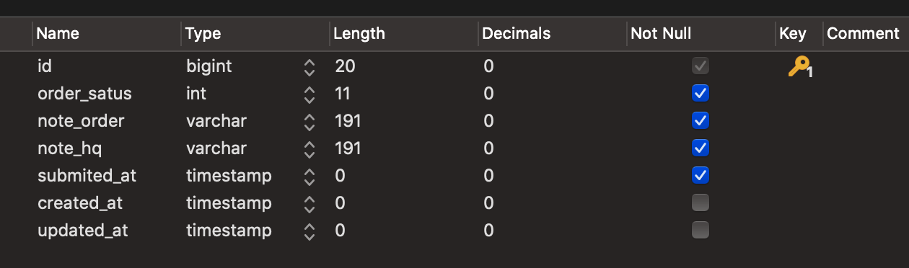
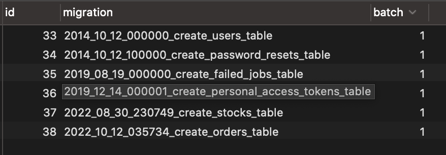

# Database Migration


## Create Table Using `Migration`

Create table migration

    php artisan make:migration create_stocks_table  


File berikut akan dihasilkan `2022_08_30_230749_create_stocks_table.php` di lokasi `database\migrations\`. Masukkan column yang dikehendaki seperti berikut : 

```php
<?php

use Illuminate\Database\Migrations\Migration;
use Illuminate\Database\Schema\Blueprint;
use Illuminate\Support\Facades\Schema;

class CreateStocksTable extends Migration
{
    /**
    * Run the migrations.
    *
    * @return void
    */
    public function up()
    {
        Schema::create('stocks', function (Blueprint $table) {
            // Senarai Column
            $table->id();
            $table->integer('order_satus');
            $table->string('note_order');
            $table->string('note_hq');
            
            // foreign column
            $table->foreignId('user_id');
            $table->foreign('user_id')->references('id')->on('users')->onDelete('cascade');
            // $table->foreign('customer_id')->references('id')->on('customers');

            $table->timestamp('submited_at')->useCurrent();

            $table->enum('method', ['credit_card', 'paypal']);
            $table->decimal('amount', 8, 2);

            // column created_at, updated_at
            $table->timestamps();
        });
    }

    /**
    * Reverse the migrations.
    *
    * @return void
    */
    public function down()
    {
        Schema::dropIfExists('stocks');
    }
}
```

Laksanakan arahan untuk migration table tersebut (Single table). Laravel akan create table ke dalam dabatase mengikut schema yang telah ditakrifkan. 

    php artisan migrate --path=database/migrations/2022_10_12_035734_create_stocks_table.php

table yang dihasilkan akan kelihatan seperti berikut :



!!! tips
    Laravel Blueprint available method [https://laravel.com/api/8.x/Illuminate/Database/Schema/Blueprint.html](https://laravel.com/api/8.x/Illuminate/Database/Schema/Blueprint.html)

## Migration workaround

Install keseluruhan migration table yang berada di `database\migrations`

    php artisan migrate:install 

Install all/changes/new tables dalam folder `database/migrations`

    php artisan migrate

Rollback table migration (rollback ke 1 step batch)

    php artisan migrate:rollback

Laravel akan rollback table yang telah di execute mengikut batch number yang tertera pada table `migrations`
 
 

Refresh migration file (drop table dan re-run semula migration file) dan run seed

    php artisan migrate:refresh --seed

    // or

Refresh and run again migration file

    php artisan migrate:fresh

Rollback batch ikut step

    php artisan migrate:rollback --step=2

The migrate:reset command will roll back all of your application's migrations:

    php artisan migrate:reset


!!! note 

    Jika berlaku error **SQLSTATE[42000]: Syntax error or access violation: 1071 Specified key was too long; max key length is 767 bytes (SQL: alter table `users` add unique `users_email_unique`(`email`))**

    Rujuk [voyager error](voyager.md)  
