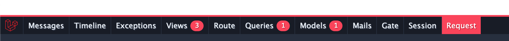
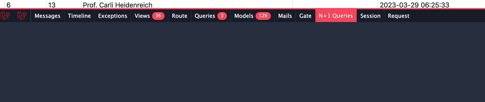

# Debugbar

Install

    composer require barryvdh/laravel-debugbar --dev

Open file `.env` and set `APP_DEBUG` to `true`.

    APP_DEBUG=true

!!! info "Reference"
    [https://github.com/barryvdh/laravel-debugbar](https://github.com/barryvdh/laravel-debugbar)

# (Optional) Install laravel-ide-helper 

Install using composer

    composer require --dev barryvdh/laravel-ide-helper --dev

Add this conditional statement in your `AppServiceProvider` to register the helper class.

    public function register()
    {
        if ($this->app->environment() !== 'production') {
            $this->app->register(\Barryvdh\LaravelIdeHelper\IdeHelperServiceProvider::class);
        }
        // ...
    }

Generate a file to help the IDE understand Facades. You will need to restart Visual Studio Code.
    
    php artisan ide-helper:generate

# (Optional) Laravel Query Detector N+1

Install package `https://github.com/beyondcode/laravel-query-detector` 

    composer require beyondcode/laravel-query-detector --dev

Customize query detector to use debugbar as default alert. 

Publish package : 

    php artisan vendor:publish --provider="BeyondCode\QueryDetector\QueryDetectorServiceProvider"

    // atau - then select Querydetector
    php artisan vendor:publish

open `config/querydetector.php`. Change output to : 

    'output' => [
        \BeyondCode\QueryDetector\Outputs\Debugbar::class
        // \BeyondCode\QueryDetector\Outputs\Alert::class,
        // \BeyondCode\QueryDetector\Outputs\Log::class,
    ]

