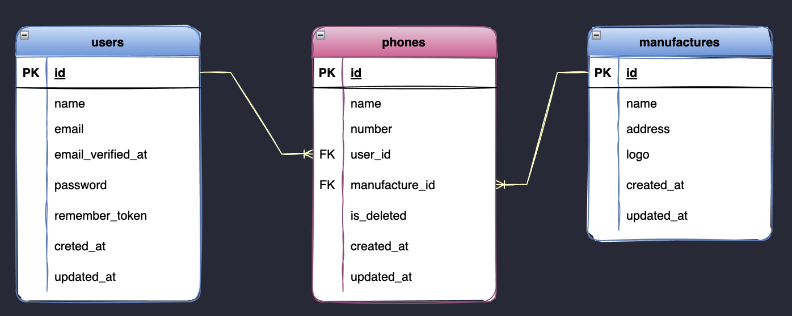

# Relationship



## User

```php
<?php
/**
 * 1 to Many
 */
public function phones()
{
    return $this->hasMany(Phone::class);
}

/**
 * Many to Many
 */
public function manufactures()
{
    return $this->belongsToMany(Manufacture::class, 'phones')->distinct();
}
```

## Phone

```php
<?php
/**
 * 1 to Many (Inverse)
 */
 public function manufacture()
{
    return $this->belongsTo(Manufacture::class);
}
```

## Manufacture

```php
<?php
/**
 *  1 to Many
 */
public function phones()
{
    return $this->hasMany(Phone::class);
}

/**
 * Many to Many
 */
public function users()
{
    return $this->belongsToMany(User::class, 'phones');
}
```

## Query 

### User Query (Multiple implementation)

1. Dapatkan pengguna dengan jumlah phone yang dimilik 

        User::withCount('phones')->get()

2. Dapatkan senarai phone yang dimilik dan pengeluar yang terlibat dengan penggunaan phone oleh pengguna

         User::with('phones', 'manufactures')->get()

3. Dapatkan pengguna beserta bilangan phone yang dimilik dan bilangan manufacture, dan senarai phone yang dimiliki untuk rekod pertama dalam db. Gantikan `first()` kepada `get()` untuk mendapatkan keseluruhan rekod.

        User::withCount([
            'phones',
            'manufactures' => function($query){
                $query->select(DB::raw('count(distinct manufacture_id)'));
            }])
        ->with('phones')
        ->first()

4. Pengguna yang mempunyai lebih dari satu phone

        User::has('phones', '>', 1)->get()

5. Dapatkan senarai pengguna yang mempunya lebih dari 5 phone beserta bilangan phone dan senarai phone

        User::has('phones', '>', 5)->withCount('phones')->with('phones')->get()

6. Dapatkan senarai pengguna yang menggunakan phone dengan nama 'Apple'

        User::with(['phones' => function($query){$query->where('name', 'like', '%Apple%');}])->get()


7. Dapakatn senarai pengguna yang mengguna phone dengan nama 'Apple' dan senarai phone tersebut
    
    ```php 
    <?php
    User::with([
        'phones' =>function($query){
            $query->where('name', 'like', '%Apple%');
        }])
    ->whereHas('phones',function($query){
        $query->where('name', 'like', '%Apple%');
    })->get()
    ```

    Eloquent query diatas boleh diganti menggunakan local scope untuk menjadikan code lebih clean

    ```php 
    <?php 
    public function scopeWithWhereHas($query, $relation, $constraint){
        return $query->whereHas($relation, $constraint)->with([$relation => $constraint]);
    }

    // panggilan 
    User::withWhereHas('phones', fn($query) => $query->where('name', 'like', '%Apple%'))->get()
    ```

8. Dapatkan senarai pengguna yang menggunakan phone dari pengeluar 'Apple'

        User::whereHas('manufactures', function($query){$query->where('manufactures.name', 'like', '%Apple%' );})->get()

9. Dapatkan senarai pengguna yang menggunakan phone dari pengeluar 'Apple' dan senarai phone (belum finalize)

    ```php 
    <?php
    User::select('users.name', 'phones.name as phone_name')
        ->join('phones', 'users.id', '=', 'user_id')
        ->join('manufactures', 'phones.manufacture_id', '=', 'manufactures.id')
        ->where('manufactures.name','like', '%Apple%')
        ->distinct()
        ->take(5)
        ->get();   
    ```   


   