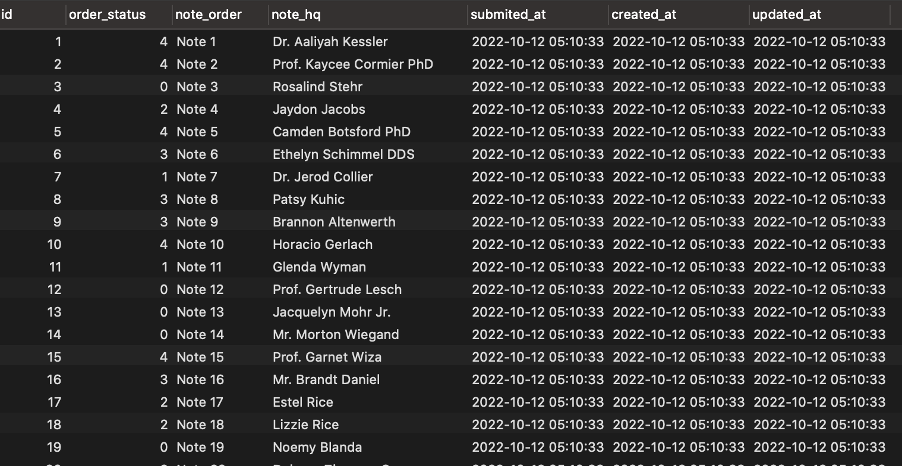

## Seeder 

Seeder digunakan untuk menjana data dummy bagi tujuan memudahkan pembangunan sistem dilaksanakan. 

Create table seeder
     
     php artisan make:seeder CompaniesTableSeeder

Masukkan code untuk seeder table 

```php
<?php

namespace Database\Seeders;

use Illuminate\Database\Seeder;
use Illuminate\Support\Facades\DB;

class CompaniesTableSeeder extends Seeder
{
    /**
    * Run the database seeds.
    *
    * @return void
    */
    public function run()
    {
        //
        DB::table('companies')->truncate();

        $companies = [];

        foreach (range(1, 1000) as $key){
            $companies[] = [
                'name' => $name = "Company $key",
                'address' => "Address $name",
                'website' => "website{$key}.com",
                'email' => "email$key@gmail.com",
                'created_at' => now(),
                'updated_at' => now()
            ];
        }

        DB::table('companies')->insert($companies);
    }
}
```

Run Seeder table
     
     php artisan db:seed --class=CompaniesTableSeeder 

Data yang telah dijana oleh  seeder akan kelihatan seperti berikut : 




or register seeder dalam file DatabaseSeeder.php

```php
<?php

namespace Database\Seeders;

use Illuminate\Database\Seeder;

class DatabaseSeeder extends Seeder
{
    /**
    * Seed the application's database.
    *
    * @return void
    */
    public function run()
    {
        // \App\Models\User::factory(10)->create();
        $this->call(CompaniesTableSeeder::class);
    }
}
```

Laksanakan arahan berikut 

     php artisan db:seeds


### Faker library

Faker library juga boleh digunakan untuk menjana data dummy yang lebih dinamik. Library ini telah obsolute tapi masih boleh digunakan. 

Masukkan code berikut di method `run()` dalam file seeder     

```php
<?php

namespace Database\Seeders;

use Faker\Factory;
use Illuminate\Database\Seeder;
use Illuminate\Support\Facades\DB;

class StockSeeder extends Seeder
{
    /**
    * Run the database seeds.
    *
    * @return void
    */
    public function run()
    {            
        DB::table('stocks')->truncate();

        $companies = [];
        $faker = Factory::create();

        foreach (range(1, 1000) as $key){
            $companies[] = [
                'name' => $faker->name,
                'address' => $faker->address,
                'website' => $faker->domainName,
                'email' => $faker->email,
                'created_at' => now(),
                'updated_at' => now()
            ];
        }

        DB::table('stocks')->insert($companies);
    }
}
```