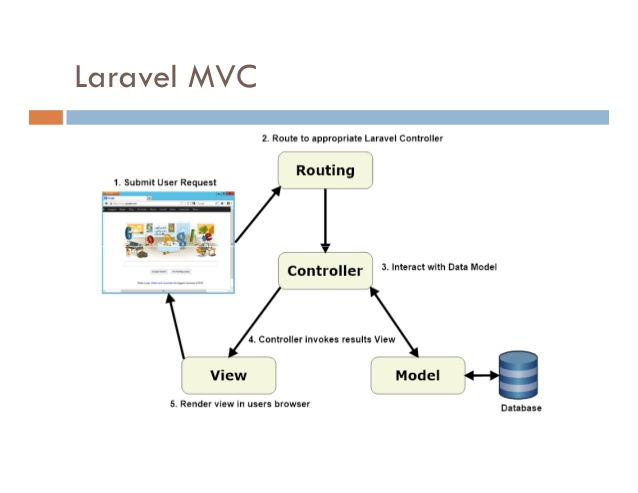
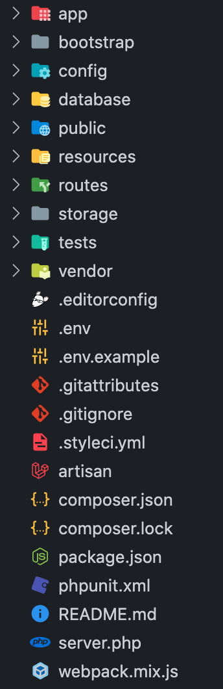

## MVC Architecture

Laravel applications follow the Model-View-Controller architecture design pattern.

1. **Models** represents the entities in database and helps you to query the database and return the data
2. **Views** are the pages which will be displayed when accessed the app. View Component is used for the User Interface of the application.
3. **Controllers** handle user requests, gets required data from the models and pass them to the Views. Controllers acts as an intermediary between Model and View Components to process the business logic and incoming request.

Source : [https://www.parthpatel.net/laravel-tutorial-for-beginner/](https://www.parthpatel.net/laravel-tutorial-for-beginner/)

## Laravel Directory Structure

## Environment Configuration File

File `.env` mengandungi basic configuration services untuk aplikasi seperti panggilan ke dabatase, email setting dan sebagainya

    DB_CONNECTION=mysql
    DB_HOST=127.0.0.1
    DB_PORT=3306
    DB_DATABASE=laravel
    DB_USERNAME=root
    DB_PASSWORD=

kesemua configuration dalam file `.env` akan dipanggil oleh laravel melalui `config/app.php` menggunakan helper method `env()` sebagai contoh : 

    'name' => env('APP_NAME', 'Laravel'),

File `.env` tidak perlu commit utuk push, untuk tujuan backup/sample file gunakan file `.env.example`

