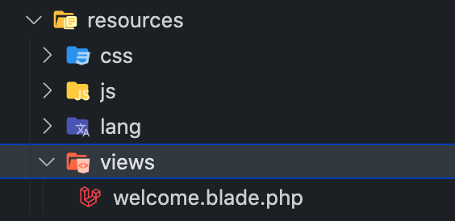

## Setup View Layout

Basic directory laravel

Create folder `resources\views\layouts\` and file `main.blade.php`. Sebagai main layout. Letakkan code berikut untuk content dari subview

    @yield('content')

di subview letakkan code berikut sebagai contoh di `resources\views\index.blade.php`

    @extends('layouts.main')

    @section('title', 'Tajuk here')

    @section('content')
    .
    .
    @endsection

dan call guna route berikut. Letak di file `routes\web.php` :

    Route::get('/', function(){
        return view('index');
    });
    
## Passing variable

    // First
    return view('folder.view_name')->with('variablename', $value)

    // Second
    return view('folder.view_name')->compact('variable_name')

    // Third
    return view('folder.view_name', [])

For more info [https://laravel.com/docs/5.5/blade](https://laravel.com/docs/5.5/blade)

## :japanese_ogre: Latihan Penggunaan Template (10 Minit)

#### Latihan 1
1. Download template dari [bootstrapmade](https://bootstrapmade.com/bizland-bootstrap-business-template/download/)
2. Masukkan template (yg dimuat turun) ke dalam laravel layout
3. Modify layout kiraan sifir menggunakan layout yang telah dikemaskini.

#### Latihan 2
1. Masukkan form yang membolehkan input number yang dikehendaki dimasukkan oleh pengguna. Form mengandungi : 
    1. Textbox
    2. Button submit
2. Papar sifir yang dikira berdasarkan number yang dimasukkan oleh pengguna