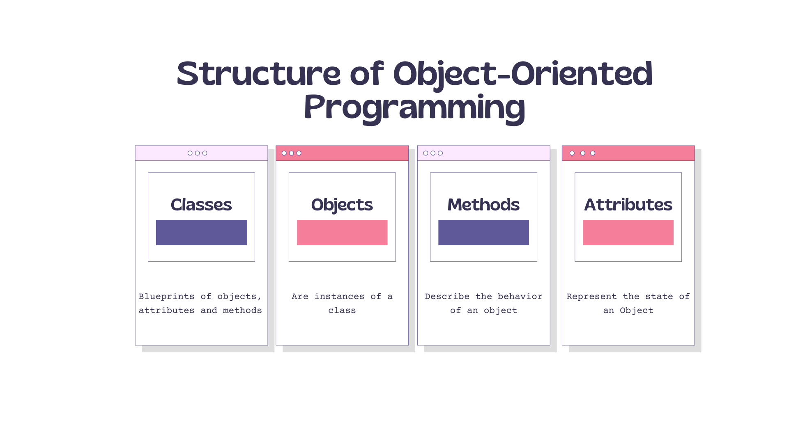

# Object Oriented Programming

Tukarkan structure berikut kepada bentuk class 


```php
<?php

$ic = "901225015656";

echo "Nama Student : Farhan <br />";
echo "Umur : " . checkIc($ic, 'age') . " Tahun <br />";
echo "Jantina : " . checkIc($ic, 'sex');


function checkIc($ic, $type)
{
    if ($type == 'sex') {
        return ((int)substr($ic, -1) % 2 == 0 ? 'Perempuan' : 'Lelaki');
    }

    // tulis pengiraan umur // assume 19
    if ($type == 'age') {        
        $year = "19" . substr($ic,0,2);
        return date('Y') - $year;        
    }
}
```